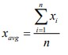
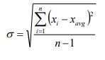

# Taller MVN-GIT

En este proyecto se trabajó una calculadora estadística la cual es capaz de calcular la media muestral y desviación estandar de un conjunto de datos determinados.
Para ello se utilizaron las siguientes formulas:



 

## Empezando

Para correr el programa debe descargar el .zip que se encuentra en el repositorio, a continuación se debe descomprimir y situarse en el directorio a través de línea de comando, por último ejecute el siguiente comando para ejecutar el .jar

```
java -cp target/cal_media_desv-0.0.1-SNAPSHOT.JAR arep.cal_media_desv.Calculadora

```

### Pre-requisitos

Únicamente necesita tener instalado Java en su computadora para que el comando funcione.

### Documentación

La documentación completa se encuentra en la carpeta doc.


## Probando

Para modificar el objeto de análisis, se debe modificar el archivo datos.txt que se encuentra en la raíz del proyecto. Cambiando, agregando o eliminando datos para su análisis, siempre siguiendo con la notación presentada en el ejemplo.

## Autor

* **Sebastián Goenaga** - *ECI*

## License

Este proyecto está licenciado bajo Apache License 2.0 - ver [LICENSE](LICENSE) para más detalles.
